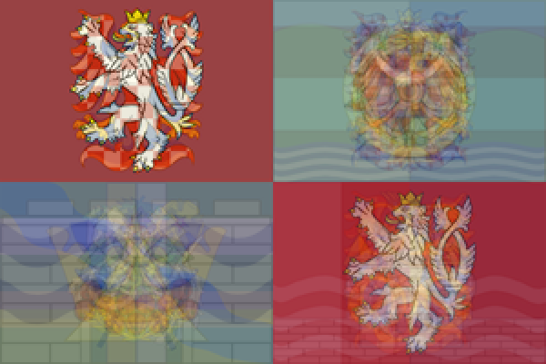
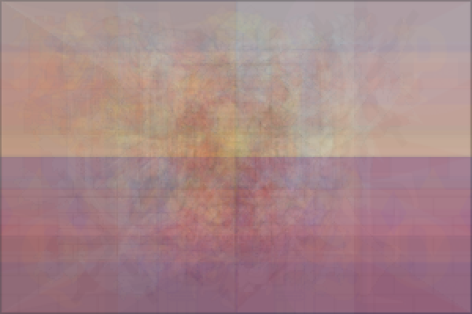
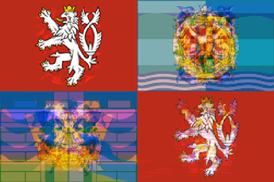
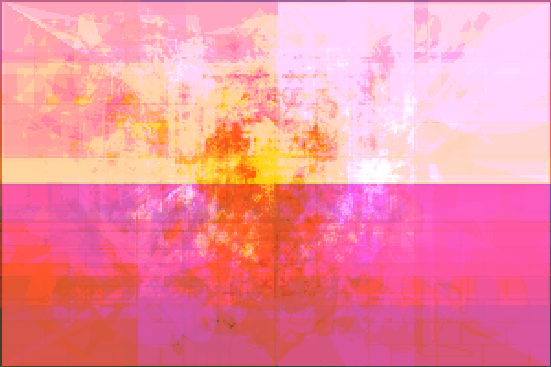

# Average flag in R

This script provides a simple way to turn a list of 300x200 px png images (flags for example) into an "average" picture. It exploits the fact that each pixel on an image can be represented by numbers ([see here](https://en.wikipedia.org/wiki/RGBA_color_model)), therefore, numerical operations are possible. 

By loading the images using the `readPNG` package, we obtain the numerical representation of each pixel in the picture in the form of an array.

For the average picture, the array of X variables (images) is *reduced* using the `Reduce` function to an array of a single variable. Each value is then averaged over the number of variables.

In case of the median picture, a more rough approach is used. The program iterates through all the values in the aforementioned array, and thus, the respective codeblock takes a while to finish. What happens is that it saves all the values for all variables for a particular pixel into a vector. It then calculates the median of that vector and saves that value into the "median array".

I applied the program to a set of flags of Czech regions and districts to test its capabilities.

### Average flag of Czech regions

### Average flag of Czech district towns

### Median flag of Czech regions

### Median flag of Czech district towns

### Dataset info

There are 76+1 (the capital) district towns in the Czech Republic. However, some districts do not have their own flag, notably Brno-venkov, Praha-západ and 3 more (see districts/no_flag.txt). Therefore, there are only 72 flags in this dataset.

### Additional information
This project was inspired by [u/Udzu's post on reddit](https://www.reddit.com/r/dataisbeautiful/comments/85l10h/average_flags_of_the_world_means_modes_and/) and [baptiste's answer](https://stackoverflow.com/questions/11306075/how-to-create-rgb-image-from-three-matrices-in-r) on the stackoverflow forum.
